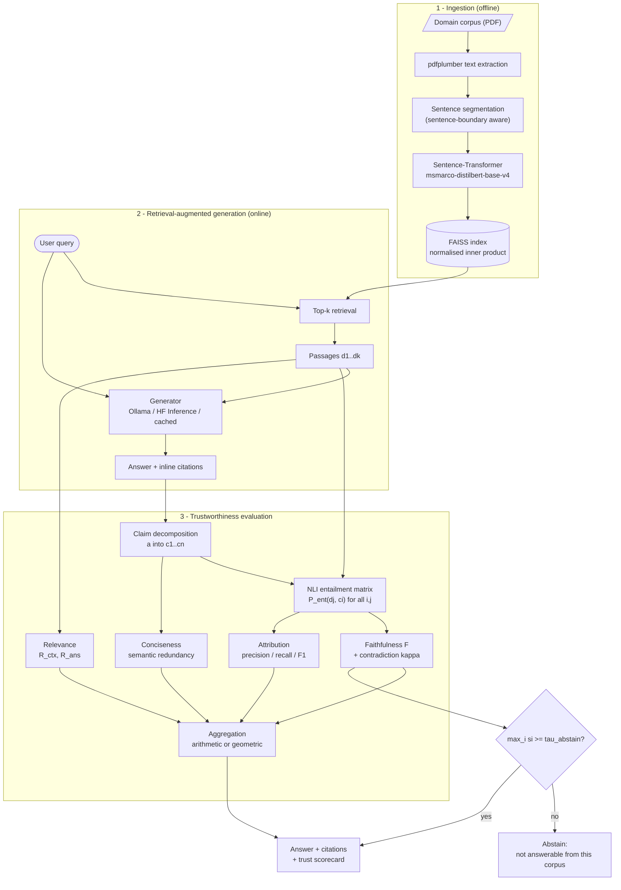
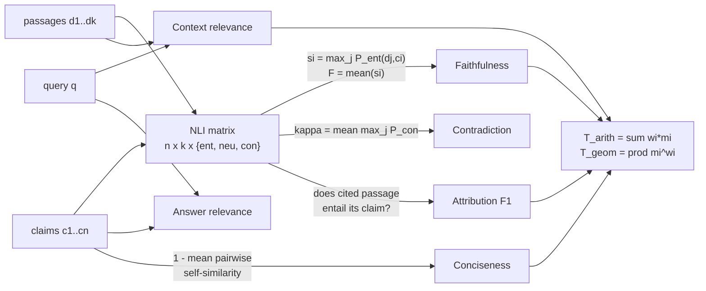
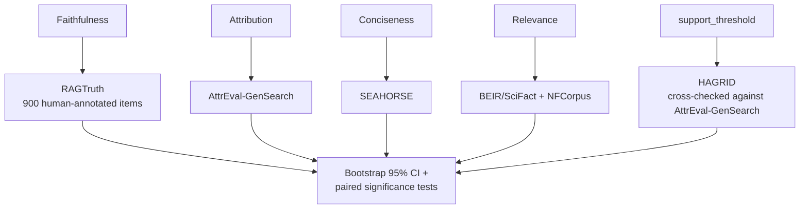
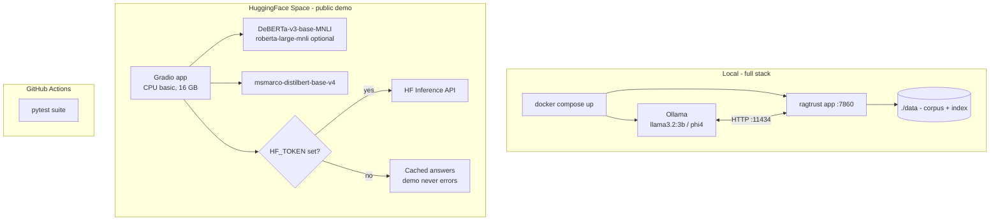

# Architecture

Three layers, deliberately separable: a retrieval-augmented generation pipeline, a
trustworthiness evaluation layer that scores what the pipeline produced, and a decision gate
that can refuse to answer. The evaluation layer is the contribution — it is designed to be
usable against *any* RAG pipeline, not only this one.

## System overview

The abstention gate is what makes this usable in an industrial setting, and it runs in **two
stages, ordered by cost**:

1. **Retrieval gate, before generation.** If nothing retrieves above `retrieval_gate`, the
   corpus does not cover the question and there is no point paying for a generation call.
   On the bundled corpus in-corpus questions retrieve at ~0.72 and out-of-corpus ones at
   ~0.08, so the `0.30` default sits in open space between the two rather than being fitted
   to either. It is calibrated rather than guessed: `experiments/09` scores 300 answerable
   BEIR/SciFact queries against 900 unanswerable ones drawn from three other BEIR sets,
   reaching ROC-AUC 0.962 pooled and 0.907 against the hardest same-domain tier. The
   objective is deliberately not accuracy — the two errors are asymmetric, since a false
   abstention refuses a question the corpus could answer and nothing downstream recovers it,
   whereas a false acceptance costs one generation call and is then caught by the second
   gate — so the threshold is the largest value retaining ≥99% of answerable queries.
2. **Grounding gate, after generation.** The corpus looked relevant, but no claim the model
   produced is actually supported by the retrieved passages. This is the case the first gate
   cannot catch, because it depends on what was generated.

Either gate returns an `abstain_reason` naming which fired and why.

## Metric computation

Every metric derives from one shared object: the `n x k` entailment matrix between the
answer's claims and the retrieved passages. Computing it once and reusing it is what keeps
evaluation affordable.

`T_geom <= T_arith` always, by weighted AM–GM (METRICS.md, Proposition 3). The geometric form
is *non-compensatory*: a near-zero on any single dimension drives the aggregate toward zero,
so a fluent, concise, well-retrieved hallucination cannot score well. The arithmetic form is
*compensatory*: strong performance on the other three dimensions can mask it.

**A dimension can be absent, and both aggregates renormalise when one is.** `conciseness`
returns `None` when an answer has fewer than two claims, because pairwise self-similarity is
undefined there (METRICS.md §II.4); an undefined metric is dropped from aggregation rather than
assigned a value. `Σwᵢ = 1` is a *premise* of weighted AM–GM, not decoration, so both aggregates
divide through by the surviving weights. Renormalising only the geometric one — as an earlier
version did — makes a perfect answer score `T_arith = 0.80` against `T_geom = 1.00`, breaking
Proposition 3 on exactly the input where the bound most needs to hold.

## Metric validation

Each trust metric is checked against an independent, third-party, human-annotated benchmark
it was not built or tuned against, rather than against ground truth this repository
constructed itself (`experiments/10`–`14`; full results and per-benchmark caveats in
`experiments/results/` and METRICS.md Part III).

## Deployment

Two deployment targets, because they serve different audiences. The Space gives a reviewer a
URL that works in one click on CPU. The compose stack runs the full local architecture —
self-hosted open-weight models via Ollama, no data leaving the machine, which is the actual
requirement in an industrial deployment setting.

The hosted demo defaults to `DeBERTa-v3-base-mnli-fever-anli` (~370 MB) rather than
`roberta-large-mnli` (~1.4 GB): it is faster on 2 vCPUs and stronger on MNLI.
`roberta-large-mnli` remains selectable as an alternative NLI backbone.

## Module map

| Path | Responsibility |
|---|---|
| `src/ragtrust/ingest/` | PDF extraction; sentence-boundary-aware segmentation |
| `src/ragtrust/retrieval/` | Embedding, FAISS index, `Retriever` (normalised inner product) |
| `src/ragtrust/generation/` | `Generator` protocol; Ollama, HF Inference API, and cached backends |
| `src/ragtrust/metrics/nli.py` | NLI scorer with label-name mapping; `FakeNLI` stub for fast tests |
| `src/ragtrust/metrics/*.py` | Faithfulness, attribution, relevance, conciseness, aggregation |
| `src/ragtrust/validation/` | Perturbation operators, ROC/AUC, bootstrap CIs, significance tests |
| `src/ragtrust/pipeline.py` | Orchestration, indexing, index persistence, both abstention gates |
| `src/ragtrust/cli.py` | `ragtrust index / ask / serve / eval` |
| `src/ragtrust/service.py` | FastAPI service: `POST /answer`, `GET /health`, `GET /config` |
| `experiments/04`–`05` | Weight-sensitivity analysis; precomputed demo data for `docs/` |
| `experiments/07`–`09` | Retrieval ablations (in-house, then BEIR/SciFact) and abstention-gate calibration |
| `experiments/10`–`14` | Third-party validation of every trust metric: RAGTruth (faithfulness), AttrEval (attribution), SEAHORSE (conciseness), BEIR qrels (relevance), HAGRID (threshold calibration) |
| `app/` | Gradio demo |

## Design decisions worth defending

**Claim-level rather than answer-level entailment.** NLI models are trained on
sentence-length hypotheses. Feeding a whole multi-sentence answer as the hypothesis — and all
retrieved passages concatenated as a single premise — both exceeds the 512-token window and
asks the model a question it was never trained on. Per-pair scoring is more calls but each
call is in-distribution.

**`max` over passages, `mean` over claims.** A claim needs only one supporting source, so
aggregation across passages is a max. The answer's overall grounding is the *proportion* of
its content that is supported, so aggregation across claims is a mean. This also makes `F`
monotone under adding passages, which a mean-over-passages would not be.

**Contradiction reported separately, not subtracted.** "Unsupported" and "refuted" require
different operational responses — the first suggests retrieval failure, the second suggests
the model is fighting its sources. Collapsing them into one number destroys that signal.

**Weights sampled, not chosen.** Any fixed weight vector is arguable. Sampling the simplex
and reporting the distribution converts "which weights?" from an assumption into a
sensitivity result.
