# RAG Trustworthiness

[](https://github.com/hharsha98/rag-trustworthiness-industrial/actions/workflows/ci.yml)
[](https://www.python.org/)
[](LICENSE)

A retrieval-augmented generation system for private document corpora, where **every answer
arrives with the evidence for it and a measurement of how well that evidence supports it** —
and where the system can decline to answer.

Built for settings that cannot send documents to a hosted API: everything runs locally against
open-weight models via Ollama, or against a hosted inference endpoint if you prefer.

**[→ Try the live system](https://ragtrust.169.58.185.43.sslip.io/)** — ask it something the
corpus covers, then ask it the capital of France and watch it decline to answer. You can also
drop in your own PDF or Markdown file and interrogate that instead.

**[→ Read the walkthrough](https://hharsha98.github.io/rag-trustworthiness-industrial/)** if
you would rather see it explained than click through it.

<sub>The live instance is a 2-vCPU VPS running open-weight models, so an answer takes a few
seconds — most of it NLI entailment rather than generation, which the per-stage timings on the
page will show you. Uploads and questions are both rate limited, and uploaded documents are
deleted after 24 hours.</sub>

---

## The idea

Most RAG systems return a fluent answer and leave you to trust it. This one cannot return an
answer without also returning:

- the passages it retrieved, with their source document and page
- the answer decomposed into claims, each scored for whether the passages actually entail it
- five trust metrics, and two aggregate scores computed from them
- or a refusal, with the reason it refused

```python
from ragtrust import Config, RAGTrustPipeline
from ragtrust.generation.ollama import OllamaGenerator

pipe = RAGTrustPipeline(Config(), generator=OllamaGenerator(model="phi4"))
pipe.index_dir("./my-documents").save("./index")

res = pipe.answer("How does sensor fusion improve robot performance?")

res.answer                    # the generated text, with [n] citations
res.trust                     # {'arithmetic': 0.63, 'geometric': 0.60, 'weights': {...}}
res.metrics                   # faithfulness, attribution, relevance, conciseness, contradiction
res.faithfulness.per_claim    # per-claim grounding scores
res.is_trustworthy            # conservative single-bit verdict
```

Ask something the corpus does not cover and it declines rather than confabulating:

```python
res = pipe.answer("What is the capital of France?")
res.abstained        # True
res.abstain_reason   # 'No passage retrieved above the relevance gate
                     #  (best similarity 0.018 < 0.3).'
```

On the bundled corpus the pipeline answers **10 of 10** in-corpus questions and declines
**10 of 10** out-of-corpus ones — mean top retrieval score 0.722 against 0.082.

## Quickstart

```bash
git clone https://github.com/hharsha98/rag-trustworthiness-industrial
cd rag-trustworthiness-industrial
python -m venv .venv && source .venv/bin/activate
pip install -e .

ragtrust index data/demo_corpus.md --out ./index
ragtrust ask "What is the purpose of max-pooling layers in CNNs?" --index ./index
```

```
Answer: Max-pooling reduces the spatial resolution of a feature map [2]. It also
enlarges the effective receptive field of later layers [1]. ...

Metrics:
  faithfulness           0.816
  contradiction_rate     0.727
  attribution            0.400
  attribution_precision  1.000
  attribution_recall     0.250
  relevance              0.419
  answer_relevance       n/a
  conciseness            0.679

Trust (arithmetic): 0.626
Trust (geometric):  0.597
Is trustworthy:     True
```

Serve it:

```bash
ragtrust serve --index ./index        # POST /answer, GET /health, GET /config
```

Or run the whole stack with self-hosted models, nothing leaving the machine:

```bash
docker compose -f docker/docker-compose.yml up
```

**Answering is deterministic.** Generation defaults to greedy decoding with a fixed seed, so the
same question against the same corpus returns the same answer and the same trust score. A
measurement that moves when nothing it measures moved is not a measurement.

## The trust metrics

Full definitions with proofs in **[METRICS.md](METRICS.md)**. In brief:

| Metric | What it measures |
|---|---|
| **Faithfulness** | `F = mean_i max_j P_entailment(passage_j, claim_i)` — the proportion of the answer actually grounded in retrieved evidence. Contradiction is reported separately as `κ`, because "unsupported" and "refuted" call for different responses. |
| **Attribution** | Citation precision / recall / F1 — does the answer point at the *right* passage, not merely at *a* passage. |
| **Context relevance** | Did retrieval find material related to the question — `max(0, cos)` against the query. |
| **Answer relevance** | Does the answer address the question *asked* — the only metric that catches a fluent, well-grounded answer to the wrong question. Opt-in: it costs a second model call. |
| **Conciseness** | Semantic redundancy among the answer's own claims — penalises padding, not length. |

**Aggregation is non-compensatory.** A weighted arithmetic mean lets fluency and relevance mask
a hallucination — a fabricated answer that reads well still scores ≈0.6. The geometric form
collapses when any dimension does, and by weighted AM–GM it can never overstate trust:

```
faithfulness=0.05, attribution=0.9, relevance=0.9, conciseness=0.95
  T_arith = 0.5700   <- passes
  T_geom  = 0.2863   <- correctly penalised
```

Both are reported. Weight choice is treated as a sensitivity question rather than an
assumption: `experiments/04` samples 10 000 Dirichlet weightings and reports how often the two
aggregators disagree on ranking (1.90% of 450 000 comparisons).

A metric can also be **undefined** rather than zero. Conciseness needs at least two claims
(pairwise self-similarity has no meaning below that) and answer relevance needs a backend that
can back-generate questions. An undefined metric is *dropped* from aggregation, never scored as
0 — and both aggregates renormalise over the surviving weights, so the AM–GM bound continues to
hold.

## How it works



Three separable layers — a RAG pipeline, an evaluation layer that scores what it produced, and
a gate that can decline. **The evaluation layer works against any RAG pipeline**, not just this
one; point it at your own retriever and generator. See **[ARCHITECTURE.md](ARCHITECTURE.md)**.

Two design choices worth knowing about:

**Chunking keeps headings attached to their content.** Splitting a document per line — the
obvious approach on slide-style material — yields ~9-word fragments that are mostly section
titles. An NLI model cannot entail a heading, and a generator correctly refuses to answer from
one. Overlapping windows fix both: the bundled corpus indexes at 92.9 words per passage.

**Abstention runs in two stages.** A retrieval gate fires *before* generation, so an
out-of-corpus question costs nothing. A grounding gate fires *after*, catching the case where
the corpus looked relevant but nothing supports what the model actually said. The retrieval gate
is calibrated, not guessed — `experiments/09` scores 300 answerable BEIR/SciFact queries against
900 unanswerable ones drawn from three other BEIR sets, reaching ROC-AUC 0.962 pooled and 0.907
against the hardest same-domain tier.

**Retrieval defaults to hybrid, and that default was measured.** Dense, BM25
(`retrieval_mode="sparse"`), Reciprocal Rank Fusion of both (`"hybrid"`), and cross-encoder
reranking (`rerank=True`) are all implemented and benchmarked on
[BEIR](https://github.com/beir-cellar/beir)'s SciFact — 5,183 third-party documents, 300
third-party queries, third-party judgments:

```bash
python experiments/08_beir_ablation.py
```

| nDCG@10 | vs dense (95% CI) |
|---|---|
| dense | 0.529 — baseline |
| hybrid | 0.644 — **+0.115** [+0.087, +0.143] |
| sparse+rerank | 0.680 — **+0.150** [+0.107, +0.193] |
| **hybrid+rerank** | **0.687** — **+0.158** [+0.118, +0.198] |

**All five non-baseline configurations beat dense at every k**, each improvement surviving a
paired bootstrap CI over 300 queries. That dense underperforms BM25 on SciFact is itself a
published BEIR result for general-purpose bi-encoders on specialised vocabulary, which is
independent evidence these numbers measure retrieval rather than a bug here.

Reranking wins by a further +0.043 and still defaults to **off**: it roughly doubles query
latency, and its unbounded cross-encoder scores are not comparable with the `retrieval_gate`
threshold. That is a cost decision documented at the config field, not a claim that it does not
help.

## Does it work?

Each metric is measured against **independent human annotation** — five benchmarks, none of them
authored by this project. Validating a metric only on data you wrote yourself measures the
difficulty of your own test set, not the metric.

```bash
python experiments/10_ragtruth_validation.py   # faithfulness
python experiments/11_attreval_validation.py   # attribution
python experiments/12_seahorse_validation.py   # conciseness
python experiments/13_relevance_validation.py  # relevance
python experiments/14_hagrid_calibration.py    # threshold calibration
```

| Metric | Benchmark | ROC-AUC |
|---|---|---|
| **Attribution** | AttrEval-GenSearch — 242 human-judged citations from live search output | **0.805** (0.737–0.868) |
| **Relevance** | BEIR SciFact — expert qrels, BM25-chosen hard negatives | **0.956** easy / **0.745** hard |
| **Conciseness** | SEAHORSE — 4,143 human repetition ratings | 0.647 overall / **0.820** where defined |
| **Faithfulness** | RAGTruth — 900 human-annotated RAG outputs | **0.683** pooled |

Three results worth reading in full:

**Relevance is tested without circularity.** The obvious approach — score the passages the
retriever returned — is invalid, because the retriever uses the *same embedder* as the metric,
so its top-k is selected by the quantity under test. Pairs are built from the judgments instead,
with hard negatives chosen by BM25 (lexical, therefore independent of the embedder). Picking
hard negatives with the dense retriever would bias the test the other way and is equally wrong.

**Conciseness is strong where it is defined, and undefined more often than expected.** Across
all 4,143 summaries it scores 0.647 and cannot beat counting sentences — because **68.5% of real
summaries decompose into fewer than two claims**, where pairwise self-similarity has no meaning.
Restricted to the 1,307 where it is genuinely computed it reaches **0.820** against 0.566 for
the best pure-length baseline (p=0.0001). It also passes a discriminant check that could have
gone the other way: SEAHORSE rates repetition and concise-representation separately, and the
metric tracks repetition (0.647) while sitting at chance on concise-representation (0.514) —
which is what "penalises padding, not length" requires and is not what a length proxy would do.

**A shipped threshold was interrogated rather than assumed.** `support_threshold = 0.5` decides
whether a citation counts as supported. Two benchmarks appear to disagree on its optimum (0.21
against 0.03), but F1 ignores true negatives so its optimum tracks class prevalence, and the two
sets have opposite skew (33.5% vs 76.6% positive). Under a prevalence-independent criterion they
agree closely — τ\* = 0.20 and 0.29, both below 0.5. The default stays at 0.5 deliberately:
attribution feeds a *trust* score, where a false "supported" inflates trust while a false
"unsupported" only deflates it, so the conservative error is the second one. Deployments
preferring recall have a documented, evidence-backed alternative (≈0.21) rather than a guess.

Full numbers, confidence intervals, permutation tests and stated limitations live in
[`experiments/results/`](experiments/results/).

## Repository layout

| Path | Contents |
|---|---|
| `src/ragtrust/pipeline.py` | Orchestration, indexing, persistence, both abstention gates |
| `src/ragtrust/metrics/` | The five trust metrics and aggregation |
| `src/ragtrust/retrieval/` | Embedding and FAISS index, BM25, RRF hybrid, cross-encoder rerank |
| `src/ragtrust/generation/` | Ollama, HF Inference and cached backends |
| `src/ragtrust/validation/` | ROC/PR-AUC, bootstrap CIs, paired permutation tests |
| `src/ragtrust/cli.py`, `service.py` | Command line and HTTP surfaces |
| `experiments/04`, `07`–`09` | Weight sensitivity, retrieval ablations, gate calibration |
| `experiments/10`–`14` | Third-party validation of every metric |
| `app/`, `docker/` | Gradio demo; compose stack and Kubernetes manifests |

## A note on the corpus

`data/demo_corpus.md` is original text written for this project, so the repository is
self-contained and everything above reproduces from a clean clone. See
[data/README.md](data/README.md).

## License

MIT — see [LICENSE](LICENSE).
