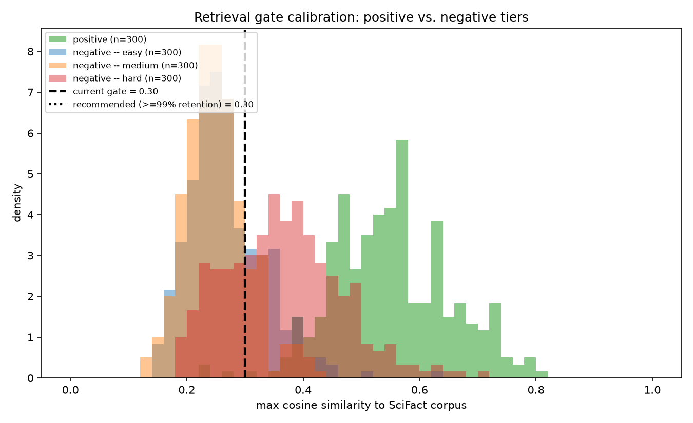

# Retrieval gate calibration

Calibrating `Config.retrieval_gate` (the pre-generation abstention gate in `RAGTrustPipeline.answer()`) against real data, replacing the constant fitted on a 32-passage toy corpus.

**Objective.** The two errors this gate can make are not equally bad. A false abstention (refusing an answerable question) is a hard, unrecoverable failure -- the user gets nothing. A false acceptance (letting an unanswerable question through) costs one generation call and is then caught by the second, post-generation grounding gate. So the right operating point is **high-sensitivity: minimize false abstention, tolerate more false acceptance** -- not the threshold that maximizes accuracy or F1, which would balance the two errors as if they cost the same.

Positives: 300 BEIR/SciFact judged test queries, scored against the 5183-document SciFact corpus. Negatives: 300 sampled queries per tier from BeIR/quora (easy), BeIR/fiqa (medium), BeIR/nfcorpus (hard), all scored against the same SciFact corpus.

**Caveat on the hard tier.** NFCorpus is biomedical, like SciFact. Some of its queries may genuinely be answerable from the SciFact corpus -- they are noisy negatives, not confirmed-unanswerable ones. The hard-tier false-acceptance rate below is a **pessimistic upper bound**, not a clean error rate.

## Similarity distributions

| group | mean | median | p5 | p25 | p50 | p75 | p95 |
|---|---|---|---|---|---|---|---|
| positive (answerable) | 0.551 | 0.544 | 0.397 | 0.476 | 0.544 | 0.622 | 0.729 |
| negative -- easy (quora) | 0.269 | 0.258 | 0.178 | 0.224 | 0.258 | 0.309 | 0.391 |
| negative -- medium (fiqa) | 0.252 | 0.246 | 0.173 | 0.214 | 0.246 | 0.280 | 0.340 |
| negative -- hard (nfcorpus, noisy) | 0.366 | 0.361 | 0.217 | 0.296 | 0.361 | 0.427 | 0.536 |
| negative -- pooled | 0.296 | 0.273 | 0.183 | 0.232 | 0.273 | 0.348 | 0.465 |

## ROC-AUC (separating positives from negatives)

| tier | AUC | 95% CI | n_pos | n_neg |
|---|---|---|---|---|
| easy | 0.986 | [0.975, 0.994] | 300 | 300 |
| medium | 0.993 | [0.985, 0.998] | 300 | 300 |
| hard | 0.907 | [0.882, 0.930] | 300 | 300 |
| pooled | 0.962 | [0.949, 0.972] | 300 | 900 |

## Recommended thresholds

Largest threshold that still retains at least the given fraction of answerable queries (<= the complementary false-abstention rate):

| retention floor | threshold | retention achieved | FAR easy | FAR medium | FAR hard(noisy) |
|---|---|---|---|---|---|
| 99% | 0.30 | 99.0% | 27.3% | 16.3% | 72.7% |
| 97.5% | 0.37 | 97.7% | 7.7% | 3.7% | 47.3% |
| 95% | 0.39 | 96.7% | 5.3% | 2.0% | 38.0% |

## Where the current gate (0.3) sits

At threshold 0.3: retains **99.0%** of answerable queries; admits 27.3% of easy, 16.3% of medium, and 72.7% of hard(noisy) negatives.

0.3 is already close to the measured >=99%-retention operating point (0.30). It retains 99.0% of answerable queries here.

**Recommendation: set `Config.retrieval_gate` to 0.30** (largest threshold meeting >=99% retention on this data). This is a recommendation only -- `src/ragtrust/config.py` is out of scope for this script and was not modified.

## Figure

